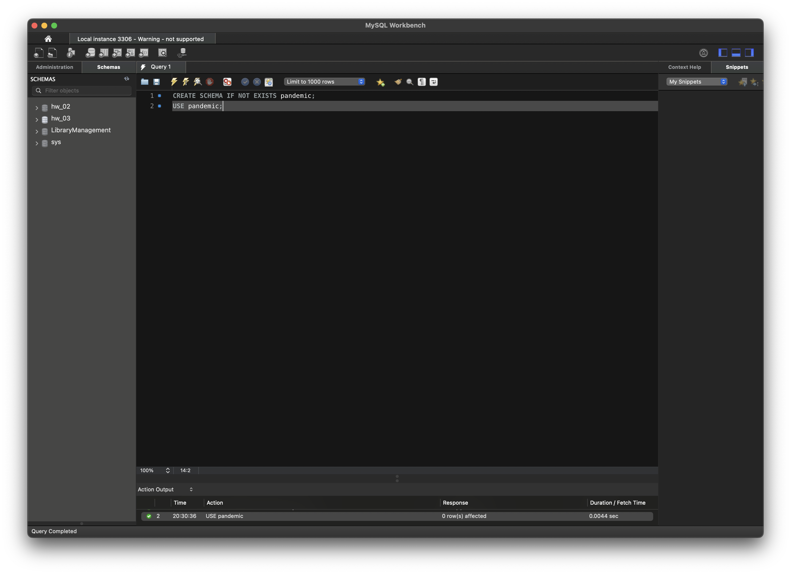
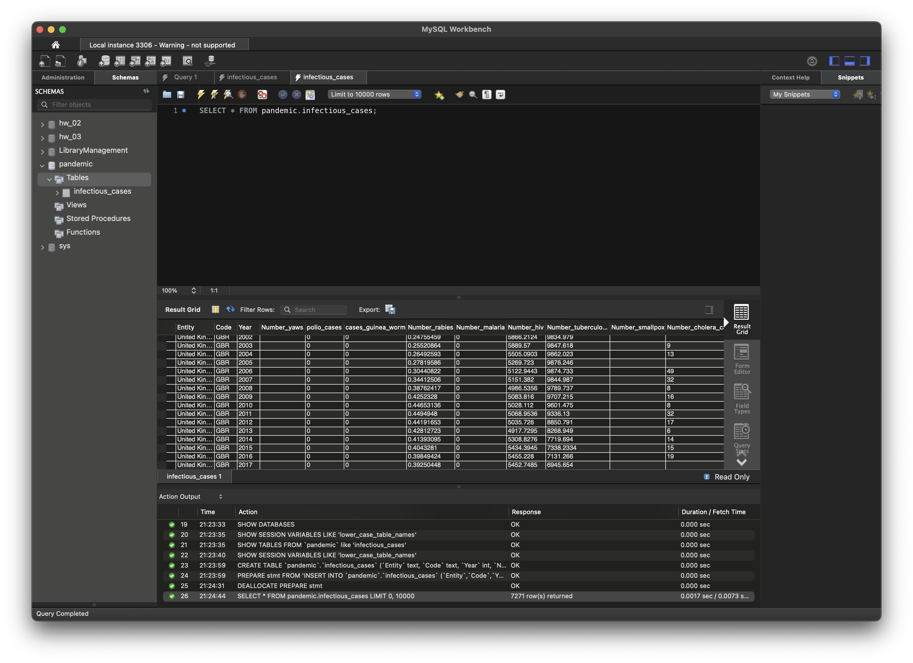
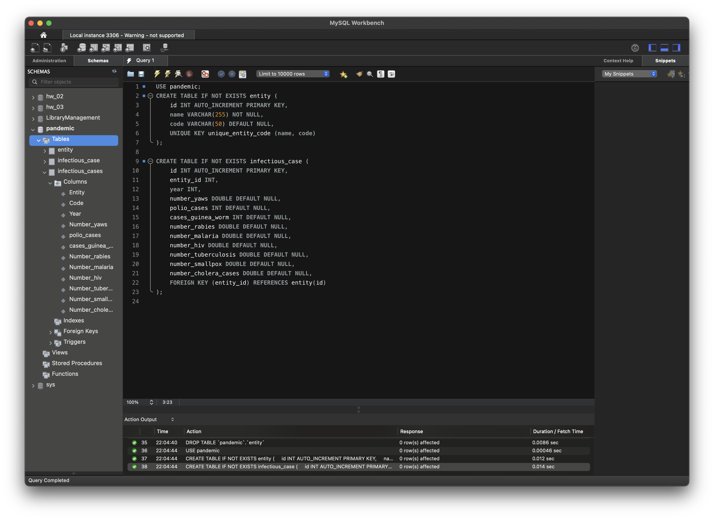
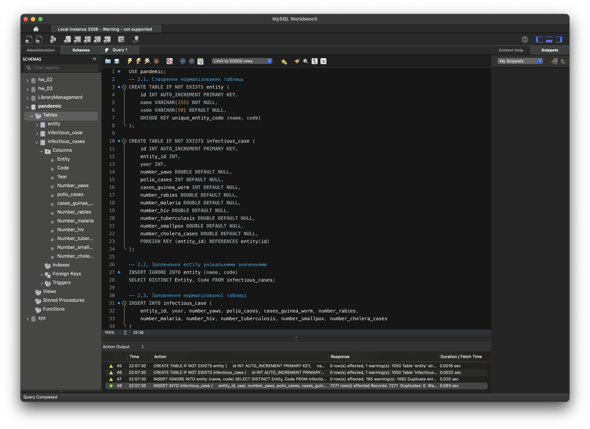
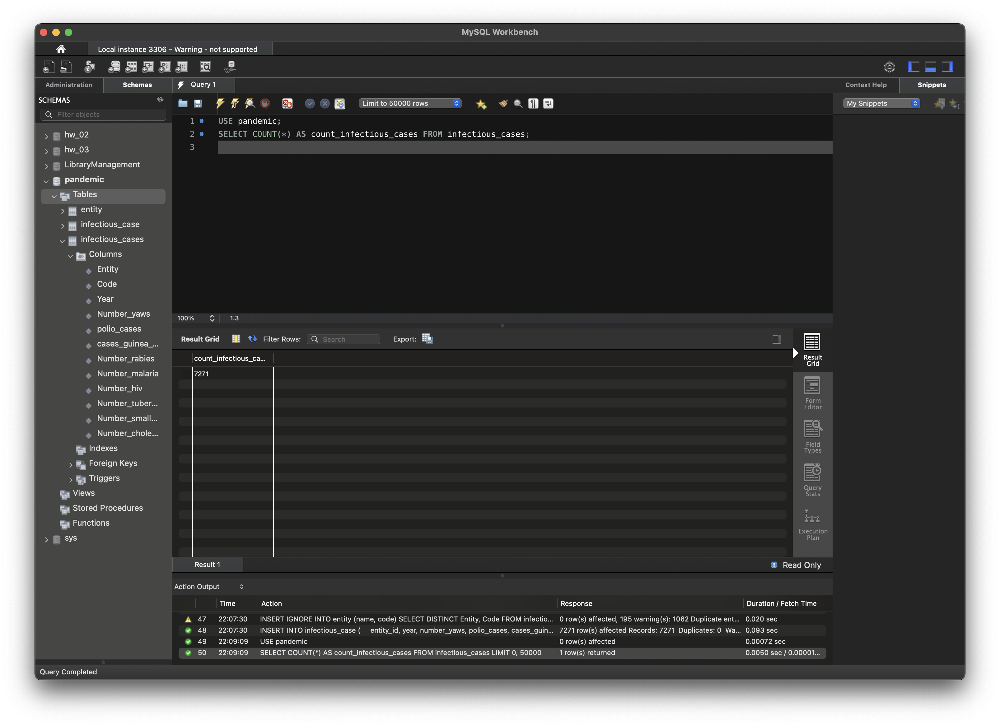
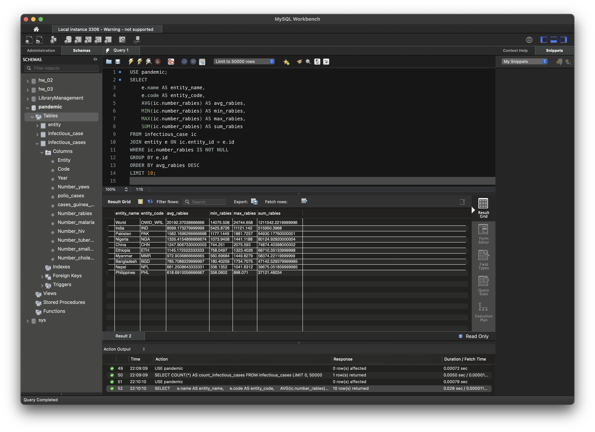
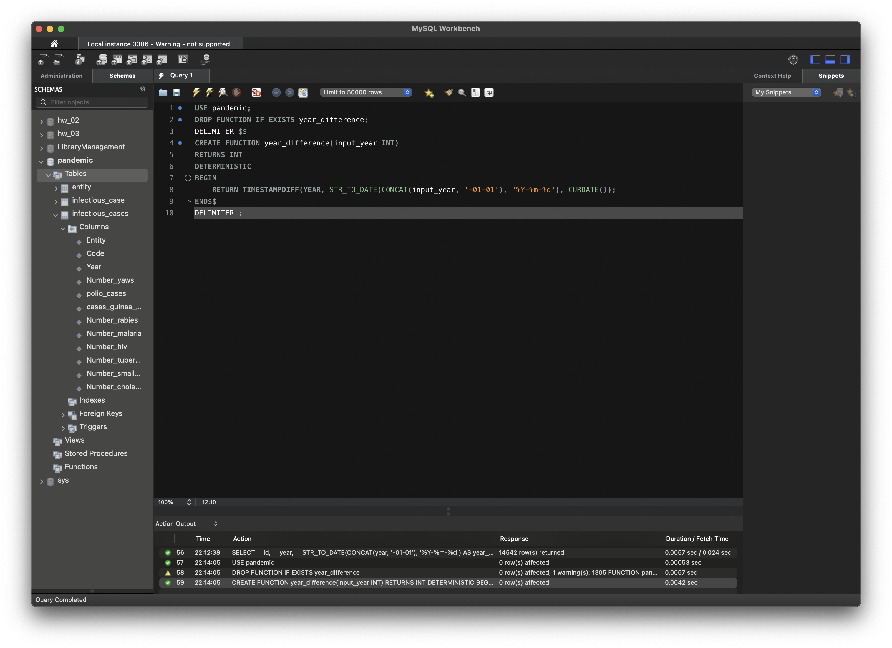
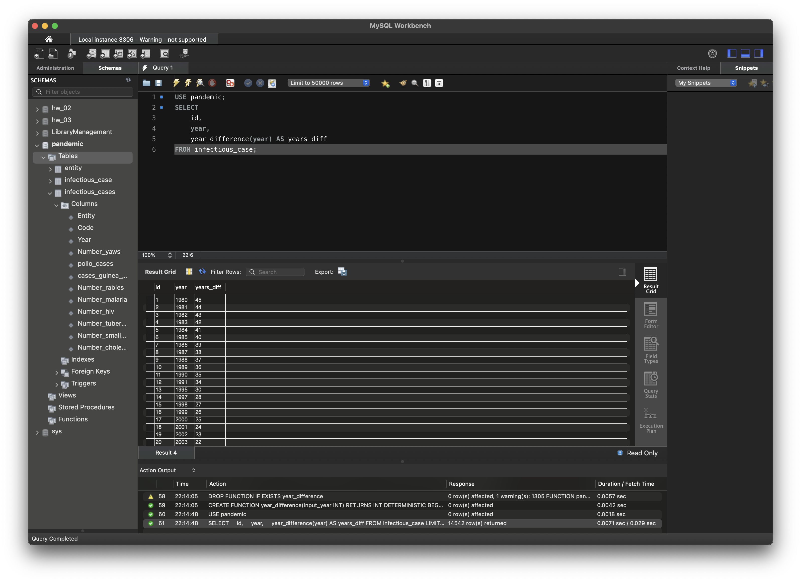
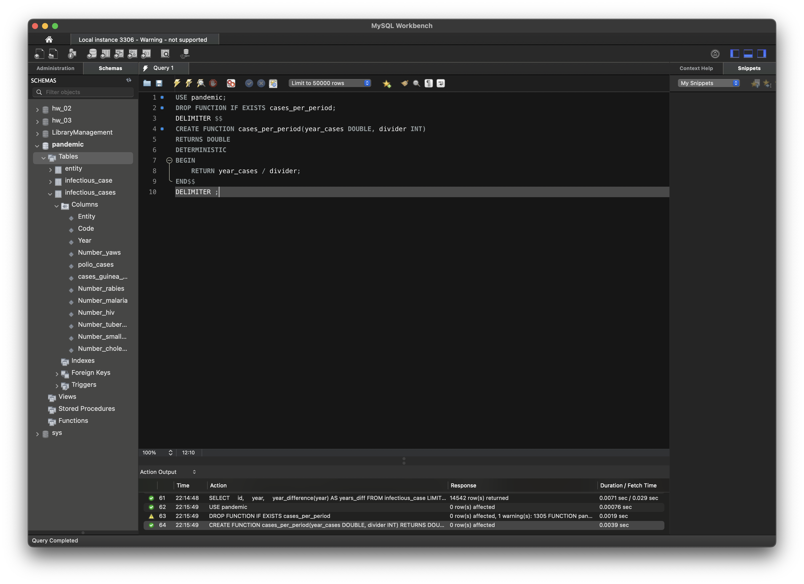
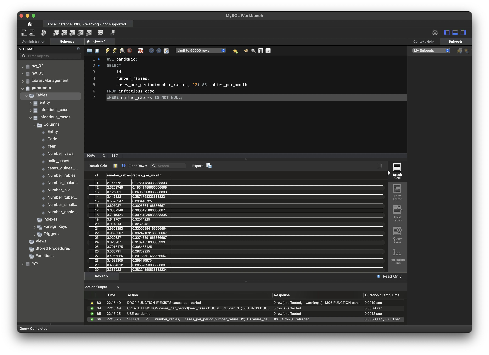

# Фінальний проєкт по SQL: Аналіз пандемічних захворювань

## 1. Створення схеми та імпорт даних

```sql
CREATE SCHEMA IF NOT EXISTS pandemic;
USE pandemic;
```

> За допомогою Import Wizard імпортували **[файл infectious_cases.csv](infectious_cases.csv)** у таблицю `infectious_cases`.


---

## 2. Нормалізація таблиці до 3NF

### 2.1. Створення таблиць

```sql
CREATE TABLE IF NOT EXISTS entity (
    id INT AUTO_INCREMENT PRIMARY KEY,
    name VARCHAR(255) NOT NULL,
    code VARCHAR(50) DEFAULT NULL,
    UNIQUE KEY unique_entity_code (name, code)
);

CREATE TABLE IF NOT EXISTS infectious_case (
    id INT AUTO_INCREMENT PRIMARY KEY,
    entity_id INT,
    year INT,
    number_yaws DOUBLE DEFAULT NULL,
    polio_cases INT DEFAULT NULL,
    cases_guinea_worm INT DEFAULT NULL,
    number_rabies DOUBLE DEFAULT NULL,
    number_malaria DOUBLE DEFAULT NULL,
    number_hiv DOUBLE DEFAULT NULL,
    number_tuberculosis DOUBLE DEFAULT NULL,
    number_smallpox DOUBLE DEFAULT NULL,
    number_cholera_cases DOUBLE DEFAULT NULL,
    FOREIGN KEY (entity_id) REFERENCES entity(id)
);
```

### 2.2. Наповнення таблиць

```sql
INSERT IGNORE INTO entity (name, code)
SELECT DISTINCT Entity, Code FROM infectious_cases;

INSERT INTO infectious_case (
    entity_id, year, number_yaws, polio_cases, cases_guinea_worm, number_rabies,
    number_malaria, number_hiv, number_tuberculosis, number_smallpox, number_cholera_cases
)
SELECT 
    e.id,
    ic.Year,
    NULLIF(ic.Number_yaws, ''),
    NULLIF(ic.polio_cases, ''),
    NULLIF(ic.cases_guinea_worm, ''),
    NULLIF(ic.Number_rabies, ''),
    NULLIF(ic.Number_malaria, ''),
    NULLIF(ic.Number_hiv, ''),
    NULLIF(ic.Number_tuberculosis, ''),
    NULLIF(ic.Number_smallpox, ''),
    NULLIF(ic.Number_cholera_cases, '')
FROM infectious_cases ic
JOIN entity e ON ic.Entity = e.name AND ((ic.Code = e.code) OR (ic.Code IS NULL AND e.code IS NULL));
```

### 2.3. Перевірка кількості записів

```sql
SELECT COUNT(*) AS count_infectious_cases FROM infectious_cases;
```

---

## 3. Аналітичний запит по Number_rabies

```sql
SELECT 
    e.name AS entity_name,
    e.code AS entity_code,
    AVG(ic.number_rabies) AS avg_rabies,
    MIN(ic.number_rabies) AS min_rabies,
    MAX(ic.number_rabies) AS max_rabies,
    SUM(ic.number_rabies) AS sum_rabies
FROM infectious_case ic
JOIN entity e ON ic.entity_id = e.id
WHERE ic.number_rabies IS NOT NULL
GROUP BY e.id
ORDER BY avg_rabies DESC
LIMIT 10;
```
> *Порожні значення автоматично ігноруються через NULL.*


---

## 4. Колонка різниці в роках

```sql
SELECT
    id,
    year,
    STR_TO_DATE(CONCAT(year, '-01-01'), '%Y-%m-%d') AS year_start_date,
    CURDATE() AS today_date,
    TIMESTAMPDIFF(YEAR, STR_TO_DATE(CONCAT(year, '-01-01'), '%Y-%m-%d'), CURDATE()) AS years_diff
FROM infectious_case;
```

---

## 5.1. Користувацька функція для різниці в роках

```sql
DROP FUNCTION IF EXISTS year_difference;
DELIMITER $$
CREATE FUNCTION year_difference(input_year INT)
RETURNS INT
DETERMINISTIC
BEGIN
    RETURN TIMESTAMPDIFF(YEAR, STR_TO_DATE(CONCAT(input_year, '-01-01'), '%Y-%m-%d'), CURDATE());
END$$
DELIMITER ;
```

### Використання функції

```sql
SELECT
    id,
    year,
    year_difference(year) AS years_diff
FROM infectious_case;
```

---

## 5.2. Альтернативна функція для середніх значень

```sql
DROP FUNCTION IF EXISTS cases_per_period;
DELIMITER $$
CREATE FUNCTION cases_per_period(year_cases DOUBLE, divider INT)
RETURNS DOUBLE
DETERMINISTIC
BEGIN
    RETURN year_cases / divider;
END$$
DELIMITER ;
```

### Використання

```sql
SELECT 
    id, 
    number_rabies,
    cases_per_period(number_rabies, 12) AS rabies_per_month
FROM infectious_case
WHERE number_rabies IS NOT NULL;
```

---
>[Повний лістинг SQL-скрипту окремо виніс у файл **fin.sql**](fin.sql)